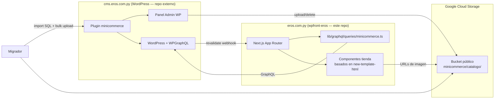
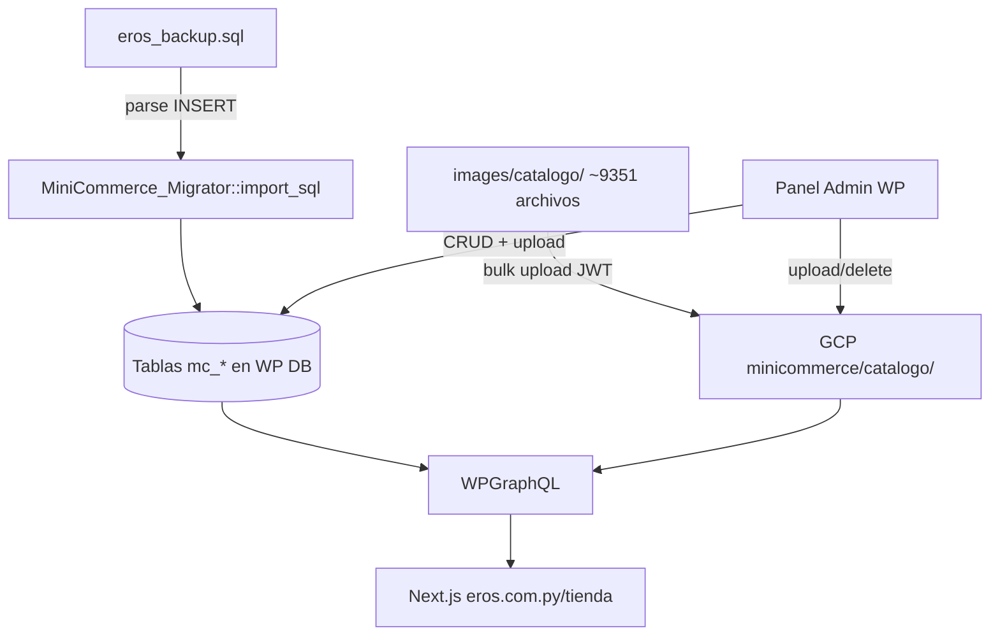

# Plugin WordPress: `minicommerce` + Frontend Headless Eros

## Contexto del proyecto


| Recurso                 | Ubicación                            | Rol                                                                                                |
| ----------------------- | ------------------------------------ | -------------------------------------------------------------------------------------------------- |
| `old-simple-ecommerce/` | Repo local (referencia)              | Sitio PHP legacy + panel admin (`panel/`) + BD (`eros_backup.sql`) + imágenes (`images/catalogo/`) |
| `new-template-html/`    | Repo local (referencia)              | Diseño HTML/CSS/JS aprobado para la tienda                                                         |
| `wpfront-eros/`         | **Este repo**                        | Frontend headless Next.js → producción en **eros.com.py** (Docker)                                 |
| WordPress               | **Repo separado** (no incluido aquí) | CMS headless → producción en **cms.eros.com.py**                                                   |


El plugin `minicommerce` vive en `wpfront-eros/wp-plugins/minicommerce/` como artefacto empaquetable (igual que `transparencia-manager/`). Se instala en el WordPress de `cms.eros.com.py`. **No se crea theme ni shortcode de WordPress**: el catálogo se renderiza íntegramente en Next.js.

---

## Objetivo

1. **Migrar** datos de `old-simple-ecommerce/eros_backup.sql` a tablas propias del plugin en la BD de WordPress.
2. **Subir** imágenes de `old-simple-ecommerce/images/catalogo/` (~9351 archivos) a un **bucket GCP público**, no al filesystem de WordPress.
3. **Replicar el panel admin** del sistema legacy (`old-simple-ecommerce/panel/`) como menús del admin de WordPress.
4. **Exponer el catálogo vía WPGraphQL** para que el frontend Next.js en `eros.com.py` consuma los datos con el diseño de `new-template-html/`.

---

## Arquitectura




### Decisiones de arquitectura


| Tema                  | Decisión                                                                                              |
| --------------------- | ----------------------------------------------------------------------------------------------------- |
| Frontend              | Next.js en `wpfront-eros/app/tienda/` — **sin** theme WP, **sin** shortcode `[minicommerce]`          |
| API de datos          | **WPGraphQL** (extensión del plugin), alineado con el resto del boilerplate (`lib/graphql/client.ts`) |
| Imágenes              | Bucket GCP con prefijo `minicommerce/catalogo/`, patrón idéntico a `transparencia-manager`            |
| URL pública de imagen | `https://{NEXT_PUBLIC_GCP_BUCKET_HOST}/minicommerce/catalogo/{filename}`                              |
| Campo en BD           | Solo el nombre de archivo (ej. `vib097j.jpg`), igual que el legacy                                    |
| Panel admin           | Réplica funcional de `old-simple-ecommerce/panel/` (artículos, secciones, subcategorías, imágenes)    |
| Usuarios              | Sistema nativo de WordPress — **no** se migran tablas `cms_`*                                         |
| Despliegue del plugin | Carpeta `wp-plugins/minicommerce/` → `.zip` → instalar en `cms.eros.com.py`                           |


---

## Análisis de la BD heredada

### Tablas a migrar


| Tabla original         | Registros aprox. | Campos clave                                                                                                                                                   |
| ---------------------- | ---------------- | -------------------------------------------------------------------------------------------------------------------------------------------------------------- |
| `eros_articulo`        | ~8837            | `id_articulo`, `nombre_articulo`, `descripcion`, `precio`, `imagen_articulo`, `id_seccion`, `id_sub_categoria`, `novedad`, `orden_articulo`, `codigo_anterior` |
| `eros_seccion`         | ~30              | `id_seccion`, `nombre`, `descripcion`, `publicado`, `orden_publicacion`                                                                                        |
| `eros_sub_categorias`  | ~112             | `id_sub_categoria`, `sub_categoria`, `id_seccion`                                                                                                              |
| `eros_imagen_articulo` | ~392             | `id_imagen_contenido`, `id_contenido`, `imagen_archivo`, `descripcion`                                                                                         |


### Tablas fuera de alcance


| Tabla                                   | Motivo                                                                  |
| --------------------------------------- | ----------------------------------------------------------------------- |
| `cms_*` (sesiones, usuarios, historial) | WordPress gestiona usuarios y auth                                      |
| `eros_sitios`                           | Sitios amigos — evaluar en fase posterior si se necesita en el frontend |
| `copia_eros_articulo`                   | Backup interno del legacy, ignorar                                      |


> **Charset:** el SQL usa `latin1`/`iso-8859-15`. El migrador convierte a `utf8mb4` al insertar.

> **Campo `novedad`:** en el legacy usa valores `1` y `2`. Preservar el valor numérico; en GraphQL exponer como `isNew: Boolean` (`novedad >= 2` o según regla de negocio confirmada).

> **Campo `codigo_anterior`:** código de producto visible (ej. `AG-002`, `VE-097`). Usarlo como `sku` / identificador en el frontend.

---

## Parte 1 — Plugin WordPress (`wp-plugins/minicommerce/`)

### Estructura

```
wpfront-eros/wp-plugins/minicommerce/
├── minicommerce.php                  ← Bootstrap: hooks, carga de clases
├── includes/
│   ├── class-db.php                  ← Tablas mc_* (activación)
│   ├── class-admin.php               ← Menús y páginas del admin WP
│   ├── class-gcp-storage.php         ← Upload/list/delete en GCP (reutiliza patrón transparencia-manager)
│   ├── class-migrator.php            ← Import SQL + bulk upload imágenes a GCP
│   ├── class-graphql.php             ← Tipos y resolvers WPGraphQL
│   └── class-revalidate.php          ← Webhook POST → eros.com.py/api/revalidate
├── admin/
│   ├── views/
│   │   ├── products-list.php         ← = panel/listado_articulos.php
│   │   ├── product-form.php          ← = panel/agregar_articulo.php
│   │   ├── sections-list.php         ← = panel/listado_secciones.php
│   │   ├── section-form.php          ← = panel/agregar_seccion.php
│   │   ├── subcats-list.php          ← = panel/listado_subcategoria.php
│   │   ├── subcat-form.php           ← = panel/agregar_subcategoria.php
│   │   ├── images-list.php           ← = panel/listado_imagenes.php
│   │   ├── image-form.php            ← = panel/agregar_imagenes.php
│   │   ├── migrator.php              ← Importación one-shot
│   │   └── settings-gcp.php          ← Bucket + Service Account JSON
│   ├── css/admin.css
│   └── js/admin.js                   ← Select dependiente sección→subcategoría (AJAX)
└── README.md                         ← Instalación en cms.eros.com.py
```

### Tablas del plugin (`$wpdb->prefix . 'mc_'`)

```sql
-- mc_articulo
CREATE TABLE {prefix}mc_articulo (
  id INT AUTO_INCREMENT PRIMARY KEY,
  nombre VARCHAR(200) NOT NULL,
  descripcion TEXT,
  precio VARCHAR(20),
  imagen VARCHAR(250),              -- solo filename, ej: vib097j.jpg
  id_seccion INT NOT NULL DEFAULT 0,
  id_sub_categoria INT DEFAULT NULL,
  novedad TINYINT DEFAULT 0,
  orden INT DEFAULT 0,
  codigo VARCHAR(200),              -- codigo_anterior del legacy
  publicado TINYINT DEFAULT 1,
  created_at DATETIME DEFAULT CURRENT_TIMESTAMP,
  updated_at DATETIME DEFAULT CURRENT_TIMESTAMP ON UPDATE CURRENT_TIMESTAMP,
  KEY idx_seccion (id_seccion),
  KEY idx_subcat (id_sub_categoria),
  KEY idx_novedad (novedad)
);

-- mc_seccion
CREATE TABLE {prefix}mc_seccion (
  id INT AUTO_INCREMENT PRIMARY KEY,
  nombre VARCHAR(255) NOT NULL,
  descripcion TEXT,
  publicado TINYINT DEFAULT 1,
  orden INT DEFAULT 0,
  slug VARCHAR(255),                -- generado en migración para URLs amigables
  KEY idx_publicado (publicado)
);

-- mc_sub_categoria
CREATE TABLE {prefix}mc_sub_categoria (
  id INT AUTO_INCREMENT PRIMARY KEY,
  nombre VARCHAR(250) NOT NULL,
  id_seccion INT NOT NULL DEFAULT 0,
  slug VARCHAR(255),
  KEY idx_seccion (id_seccion)
);

-- mc_imagen_articulo (galería adicional por producto)
CREATE TABLE {prefix}mc_imagen_articulo (
  id INT AUTO_INCREMENT PRIMARY KEY,
  id_articulo INT NOT NULL,
  imagen VARCHAR(250) NOT NULL,
  descripcion VARCHAR(250),
  created_at DATETIME DEFAULT CURRENT_TIMESTAMP,
  KEY idx_articulo (id_articulo)
);
```

### GCP Storage (`class-gcp-storage.php`)

Reutilizar el patrón de autenticación JWT de `transparencia-manager.php`:

- **Prefijo de objetos:** `minicommerce/catalogo/`
- **Configuración:** página *MiniCommerce → Ajustes GCP* (bucket name + service account JSON)
- **Operaciones admin:**
  - `upload($local_path, $filename)` → sube a `minicommerce/catalogo/{filename}`
  - `delete($filename)` → elimina objeto en GCP
  - `get_public_url($filename)` → `https://{bucket}/{minicommerce/catalogo}/{filename}`
- **Subida desde formulario:** el formulario de artículo sube directamente a GCP (no pasa por Media Library de WP)
- **Opción compartida de credenciales:** si `transparencia-manager` ya está instalado, reutilizar las mismas options de bucket/JSON o unificar en options `mc_gcp_`*

### Panel de administración

Menú **MiniCommerce** en WP Admin (ícono `dashicons-cart`):


| Submenú          | Origen legacy              | Funcionalidad                                                 |
| ---------------- | -------------------------- | ------------------------------------------------------------- |
| Artículos        | `listado_articulos.php`    | Listado paginado, filtros por sección/subcategoría, buscador  |
| Agregar Artículo | `agregar_articulo.php`     | CRUD con upload GCP, select sección, subcategoría dependiente |
| Secciones        | `listado_secciones.php`    | CRUD secciones, toggle publicado, orden                       |
| Subcategorías    | `listado_subcategoria.php` | CRUD con sección padre                                        |
| Imágenes         | `listado_imagenes.php`     | Galería adicional por artículo                                |
| Migrador         | —                          | Import SQL + bulk upload imágenes (one-shot)                  |
| Ajustes GCP      | —                          | Bucket + credenciales                                         |


Al guardar/eliminar contenido → disparar `class-revalidate.php` → `POST https://eros.com.py/api/revalidate` con tag `minicommerce`.

### WPGraphQL (`class-graphql.php`)

Registrar tipos custom (requiere plugin **WPGraphQL** activo en cms):

```graphql
type McProduct {
  id: ID!
  databaseId: Int!
  sku: String          # codigo_anterior
  title: String!
  description: String
  price: String
  imageUrl: String     # URL completa GCP
  imageFilename: String
  section: McSection
  subcategory: McSubcategory
  isNew: Boolean
  order: Int
  gallery: [McProductImage!]
}

type McSection {
  id: ID!
  databaseId: Int!
  name: String!
  slug: String!
  description: String
  published: Boolean
  order: Int
  subcategories: [McSubcategory!]
  productCount: Int
}

type McSubcategory {
  id: ID!
  databaseId: Int!
  name: String!
  slug: String!
  section: McSection
}

type McProductImage {
  id: ID!
  url: String!
  description: String
}

type Query {
  mcProducts(
    sectionId: Int
    subcategoryId: Int
    search: String
    isNew: Boolean
    first: Int
    offset: Int
  ): McProductConnection

  mcProduct(id: Int, sku: String): McProduct
  mcSections(publishedOnly: Boolean): [McSection!]
  mcSection(id: Int, slug: String): McSection
}
```

---

## Parte 2 — Frontend Next.js (`wpfront-eros/`)

### Estructura nueva

```
wpfront-eros/
├── app/
│   └── tienda/
│       ├── page.tsx                    ← Catálogo principal (grid de productos)
│       ├── [sectionSlug]/
│       │   └── page.tsx                ← Productos por sección
│       ├── producto/
│       │   └── [sku]/
│       │       └── page.tsx            ← Detalle de producto
│       ├── novedades/
│       │   └── page.tsx                ← Productos con isNew=true
│       └── layout.tsx                  ← Layout tienda (header propio, age gate)
├── components/
│   └── Minicommerce/
│       ├── ProductGrid.tsx             ← Grid de tarjetas
│       ├── ProductCard.tsx             ← Tarjeta individual
│       ├── ProductDetail.tsx           ← Modal/página detalle
│       ├── CategorySidebar.tsx         ← Sidebar categorías (del template)
│       ├── CartDrawer.tsx              ← Carrito (localStorage, sin checkout WP)
│       ├── SearchBar.tsx               ← Búsqueda (Algolia opcional en fase 2)
│       ├── AgeGate.tsx                 ← Verificación +18
│       └── minicommerce.module.css     ← Estilos portados de new-template-html/styles.css
├── lib/
│   ├── graphql/
│   │   └── queries/
│   │       └── minicommerce.ts         ← Queries GraphQL del catálogo
│   └── minicommerce/
│       ├── image-url.ts                ← buildImageUrl(filename) → GCP URL
│       └── cart.ts                     ← Lógica carrito client-side
└── public/
    └── tienda/
        └── logo.webp                   ← Logo del template
```

### Port del diseño (`new-template-html/`)


| Archivo origen | Destino                                         | Notas                                                                   |
| -------------- | ----------------------------------------------- | ----------------------------------------------------------------------- |
| `index.html`   | Componentes React en `components/Minicommerce/` | JSX semántico, sin HTML estático                                        |
| `styles.css`   | `minicommerce.module.css`                       | CSS Modules, namespace `.mc` para evitar colisiones                     |
| `app.js`       | Hooks + componentes client                      | Reemplazar `PRODUCTS` mock por datos GraphQL; carrito en `localStorage` |


### Queries GraphQL (`lib/graphql/queries/minicommerce.ts`)

```typescript
// Ejemplo — alineado con lib/graphql/client.ts existente
export const GET_PRODUCTS = `
  query GetProducts($sectionId: Int, $search: String, $first: Int, $offset: Int) {
    mcProducts(sectionId: $sectionId, search: $search, first: $first, offset: $offset) {
      nodes {
        databaseId
        sku
        title
        description
        price
        imageUrl
        isNew
        section { name slug }
        subcategory { name slug }
      }
      pageInfo { total hasMore }
    }
  }
`;
```

Cache ISR con tags: `tags: ['minicommerce', 'minicommerce-products']`.

### URLs de imagen (`lib/minicommerce/image-url.ts`)

```typescript
const BUCKET_HOST = process.env.NEXT_PUBLIC_GCP_BUCKET_HOST!;
const PREFIX = 'minicommerce/catalogo';

export function buildImageUrl(filename: string): string {
  if (!filename) return '/tienda/placeholder.webp';
  return `${BUCKET_HOST}/${PREFIX}/${encodeURIComponent(filename)}`;
}
```

---

## Flujo de migración




### Migrador (`class-migrator.php`)

Ejecución **manual, one-shot** desde *MiniCommerce → Migrador* en el admin de WP:

1. **Importar BD**
  - Parsear `eros_backup.sql` (ruta configurable vía constante o upload)
  - Mapear `eros_`* → `mc_*` preservando IDs originales
  - Convertir charset `latin1` → `utf8mb4`
  - Generar `slug` para secciones y subcategorías
  - Idempotente: truncar tablas `mc_*` antes de reimportar (con confirmación)
2. **Subir imágenes a GCP**
  - Leer directorio local `images/catalogo/` (ruta configurable)
  - Subir cada archivo a `minicommerce/catalogo/{filename}` vía API REST de GCS
  - Progreso por lotes (AJAX) para evitar timeouts PHP
  - Skip si el objeto ya existe en el bucket
3. **Verificación post-migración**
  - Conteo: productos, secciones, subcategorías, imágenes en BD vs legacy
  - Muestra aleatoria de URLs GCP accesibles
  - Reporte de archivos en disco sin registro en BD (huérfanos)

> El SQL y las imágenes locales son **artefactos de migración**. En producción las imágenes viven exclusivamente en GCP.

---

## Variables de entorno

### WordPress (`cms.eros.com.py`)


| Variable / Option      | Descripción                                      |
| ---------------------- | ------------------------------------------------ |
| `mc_gcp_bucket`        | Nombre del bucket (option WP)                    |
| `mc_gcp_json`          | Service Account JSON (option WP)                 |
| `mc_revalidate_url`    | `https://eros.com.py/api/revalidate`             |
| `mc_revalidate_secret` | Mismo valor que `REVALIDATE_SECRET` del frontend |


### Next.js (`eros.com.py` — `.env.local`)

```bash
WORDPRESS_URL=https://cms.eros.com.py
NEXT_PUBLIC_GCP_BUCKET_HOST=https://media.eros.com.py
NEXT_PUBLIC_GCP_BUCKET_NAME=media.eros.com.py
REVALIDATE_SECRET=...
```

---

## Fases de implementación

### Fase 1 — Plugin core + BD + GCP

- [ ] Scaffold `minicommerce.php` + activación de tablas `mc_*`
- [ ] `class-gcp-storage.php` (patrón transparencia-manager, prefijo `minicommerce/catalogo/`)
- [ ] Página Ajustes GCP
- [ ] `class-revalidate.php` (webhook ISR)

### Fase 2 — Migrador

- [ ] `class-migrator.php`: import SQL con conversión charset
- [ ] Bulk upload imágenes a GCP con progreso AJAX
- [ ] UI migrador con estadísticas y confirmación

### Fase 3 — Panel admin

- [ ] CRUD artículos (upload GCP, filtros, paginación)
- [ ] CRUD secciones y subcategorías
- [ ] CRUD imágenes adicionales por producto
- [ ] Select dependiente sección → subcategoría (JS)

### Fase 4 — WPGraphQL

- [ ] `class-graphql.php`: tipos, conexiones, filtros, resolvers
- [ ] Resolver `imageUrl` construye URL GCP en servidor
- [ ] Probar queries en GraphiQL de cms.eros.com.py

### Fase 5 — Frontend Next.js

- [ ] Port CSS/HTML/JS de `new-template-html/` a componentes React
- [ ] Queries en `lib/graphql/queries/minicommerce.ts`
- [ ] Rutas `/tienda`, `/tienda/[sectionSlug]`, `/tienda/producto/[sku]`, `/tienda/novedades`
- [ ] Age gate, carrito localStorage, theme toggle
- [ ] Integrar revalidación ISR

### Fase 6 — Producción

- [ ] Empaquetar plugin → instalar en cms.eros.com.py
- [ ] Ejecutar migrador en staging
- [ ] Verificar catálogo en eros.com.py/tienda
- [ ] Configurar Algolia para búsqueda de productos (opcional)

---

## Plan de verificación

1. **Activar plugin** en cms → tablas `{prefix}mc_`* creadas.
2. **Configurar GCP** → subir imagen de prueba desde admin → accesible en URL pública del bucket.
3. **Ejecutar migrador SQL** → conteos coinciden con legacy (~8837 productos, ~30 secciones, ~112 subcategorías).
4. **Ejecutar migrador imágenes** → archivos en `minicommerce/catalogo/` del bucket.
5. **GraphQL** → query `mcProducts(first: 5)` devuelve JSON con `imageUrl` válidas.
6. **Frontend** → `/tienda` renderiza grid con diseño aprobado y datos reales.
7. **CRUD admin** → crear/editar/eliminar artículo → cambio visible en frontend tras revalidación.
8. **Detalle** → `/tienda/producto/VE-097` muestra producto con galería.

---

## Preguntas resueltas


| Pregunta anterior            | Respuesta                                                                                      |
| ---------------------------- | ---------------------------------------------------------------------------------------------- |
| ¿Dónde se instala WordPress? | Repo separado en `cms.eros.com.py`. Plugin empaquetado desde `wp-plugins/minicommerce/`.       |
| ¿SQL one-shot o recurrente?  | **One-shot manual** desde página Migrador. No en activación automática.                        |
| ¿URLs de imagen?             | Filename en BD + URL pública GCP: `https://media.eros.com.py/minicommerce/catalogo/{filename}` |
| ¿Frontend en WP o Next.js?   | **Next.js** en eros.com.py. Sin theme, sin shortcode.                                          |
| ¿Imágenes locales en WP?     | **No.** Solo GCP, igual que transparencia-manager.                                             |


## Preguntas pendientes

- [x] **Dominio del bucket GCP para Eros:** ¿`media.eros.com.py` u otro?
- [x] **Regla `novedad`:** ¿valor `2` = novedad activa? Confirmar mapeo a `isNew`.
- [ ] `**eros_sitios` (sitios amigos):** ¿se necesita en el frontend o se descarta? R: Descartar
- [ ] **Algolia para productos:** ¿indexar catálogo en fase 1 o post-lanzamiento? R: Dejemos para el proximo paso
- [ ] **Checkout/pedidos:** el template tiene carrito client-side — ¿hay flujo de compra definido o solo catálogo informativo? R: La idea del carrito es muy simple, solamete generar texto para click pedido por whatsapp, eso si hay que tener una forma de configurar el numero de recepcion del mensaje